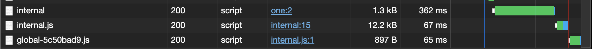

I've been using Svelte as my Javascript framework of choice for the past few weeks, and I've gotta say: it's really fucking good.

A lot of Javascript frameworks care about bundle size and make a big show of how small their framework is. React developers celebrate when the framework is only 60kb gzipped, and Vue developers shit on React developers because Vue is supposedly much smaller and faster than React. There's this big competition between different framework authors to reduce the amount of code that the core framework requires in order to get running at any cost. If your bundle size is smaller, then things must be faster.

Svelte takes a little bit of a different approach: it tries to reduce its bundle size as much as possible, but it does so in a creative way: it compiles your code _before it's used in the browser_. In Svelte, you write your components in a superset of HTML, CSS, and Javascript (you might call it 'SvelteScript'). Svelte takes all of the code you write, runs it through a compiler, and outputs simple, efficient Javascript files that perform updates to the DOM atomically, with near-zero overhead. There's no need for a virtual DOM ([Svelte's creator isn't a fan of them](https://svelte.dev/blog/virtual-dom-is-pure-overhead)) becuase all of the hard work of reconcilation and figuring out performace is moved to the compilation step and done with static analysis.

As a result, the core framework code (the stuff that actually manipulates the DOM) turns out to be **much** smaller than many other frameworks:

As a result, Svelte is a lot faster than it's competitors. It has no need for a virtual DOM, no need to do diffing client-side, no need to do a lot of 'framework' work on the client-side. That's all done _before the code gets sent to the user's browser_.

In his post, Rick offers a quote from Pete Hunt, one of the former core React developers. In his talk, Pete talks about React and performance with React:

> React is not magic. Just like you can drop into assembler with C and beat the C compiler, you can drop into raw DOM operations and DOM API calls and beat React if you wanted to. However, using C or Java or JavaScript is an order of magnitude performance improvement because you don't have to worry...about the specifics of the platform. With React you can build applications without even thinking about performance and the default state is fast.

In this analogy, React is not the C compiler, it's Ruby. Or maybe it's Javascript. It's like an interpreted language that must be parsed before it's executed. And just like an interpreted langauge, there's quite a lot of overhead. React has to do diffing. It has to do lots of checks and execute all of your component code in the right way. It has to manage state. It now (thanks to server components) has to manage communication with the server. It has to manage event lifecycles and APIs that avoid forcing you to diff stuff every time. React has to do a lot for you, and _it does it all in the browser_.

Svelte taskes the opposite approach: instead of interpreting the framework, we'll compile it. All of that work will be done before the code even touches the browser, which means things are faster for your users, the associated framework code is **much smaller**, and there's less for you to think about with performance.
