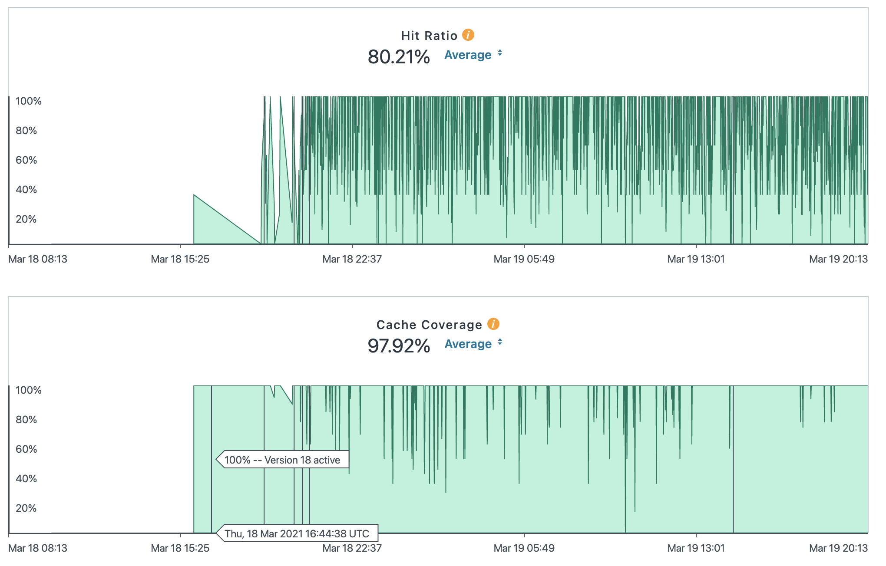
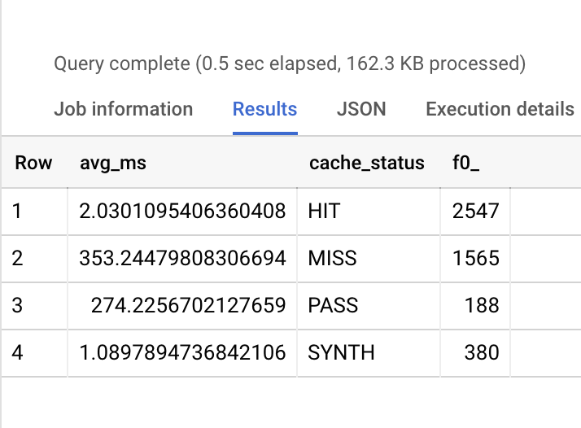

The Nine recently switched our main site ([nine.is](https://nine.is/)) over to Fastly our new CDN partner. After some work with Fastly, we noticed some pretty awesome improvements in speed.

# Why did we need a CDN?

Caboose, our CMS, has served us well for quite a while, but it's been slowing down over the past several years. We host our sites all on the same hosting infrastructure (we have multiple servers, but all of them can serve any site). As we added more sites to our network, the server response time ([called Time to First Byte](https://web.dev/time-to-first-byte/)) increased significantly. At it's peak, we'd see initial delays of up to 2 seconds.

The job of a CDN is to **reduce the number of requests hitting your server**. CDNs like Fastly cache pages as they serve them (meaning they store a copy of the page on their server). After the initial request, if another request comes in for the same page, CDNs like Fastly will serve the cached copy until we tell them to stop doing so (called _purging the cache_). A 'cache hit' is a request that's served from the CDN cache without it ever reaching our own servers. A cache hit ratio is the total number of cache hits divided by the total number of requests. The higher the cache hit ratio, the better.

If a cache hit ratio is higher, that means a _fewer number of requests are hitting our servers_. If the cache hit ratio is 80%, that means 80% of requests aren't hitting our servers, and conversely, that 20% of all requests are hitting our servers. So we needed a CDN because it would speed up our sites and reduce the number of requests we have to deal with, saving us significantly on server costs.

# Why Fastly?

We initially brought Fastly onboard for a seperate internal project, but after some exploring, we decided that it'd be a good idea to switch from our current CDN provider, CloudFlare. CloudFlare had a generous free tier with unlimited bandwidth, but its caching left much to be desired. Our cache hit ratio was about 25% on average across all of our sites.

Fastly had a more impressive cache invalidation API and offered much more granular customization than CloudFlare gave us. Their sales team was much more responsive and hands-on, and the onboarding process was amazing. Everything, from the console to the team we worked with, was impressive and best-in-class.

## Moving over our nine.is site

After some work with Fastly initially, we decided our best course of action would be to move over one of our sites to their platform to see how it would fare. After some internal discussion, we decided to move over our own site. We spent a few weeks working with the config options, trying to tune the cache to our site and hosting platform. After some work, we decided to release our initial version and take the site live this week.

Moving our site over was a breeze. Configuring TLS, DNS, and the rest was amazingly simple thanks to Fastly's intuitive UI. We moved over the DNS in under an hour and had the new version of our site live very quickly.

# Results

Our cache hit ratios are incredibly high. 80% of all served requests are cached, which is ridiculous:

Page load times have also decreased by quite a lot. This table shows the average time it takes for a request to be served from Fastly over an hour timeframe. `MISS` indicates that there was not a cache hit (meaning the request hit our servers), and `HIT` indicates that Fastly served the request.

When a request was sent to our servers, it took on average 300-ish milliseconds for it to resolve. When a request was sent from Fastly, it took **2 milliseconds** to resolve. That's about a 99% decrease.

Across the board we saw faster initial page load times, but not as much of an improvement in our PageSpeed and Lighthouse scores. Because Lighthouse and PageSpeed measure user experience (not just how fast it takes for something to load), not all of the metrics they measured were impacted by the increase in speed Fastly gave us. Increasing the speed of our site will require being more frugal with how we include Javascript, being smarter with inlining critical CSS, and doing other more technical things to improve user experience for our websites.

Insert conclusion here on how Fastly was a good choice, we're fairly happy with it, and we're looking to migrate more of our customers' sites over to it.
